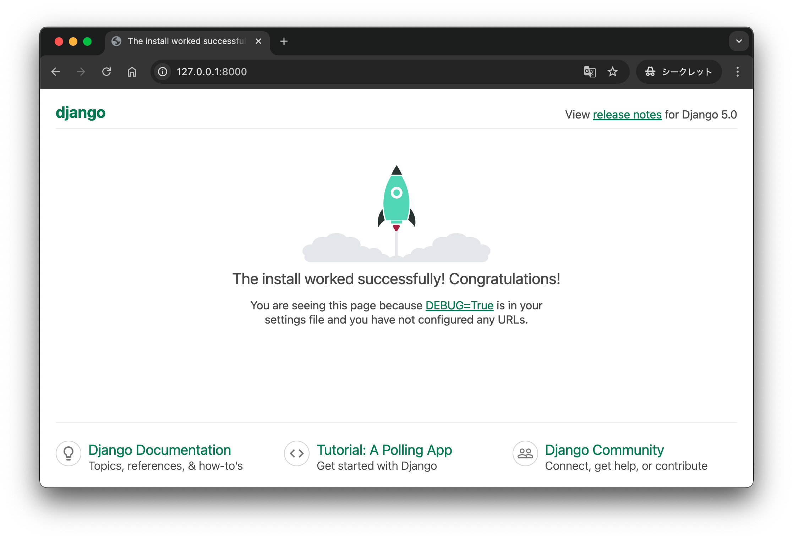
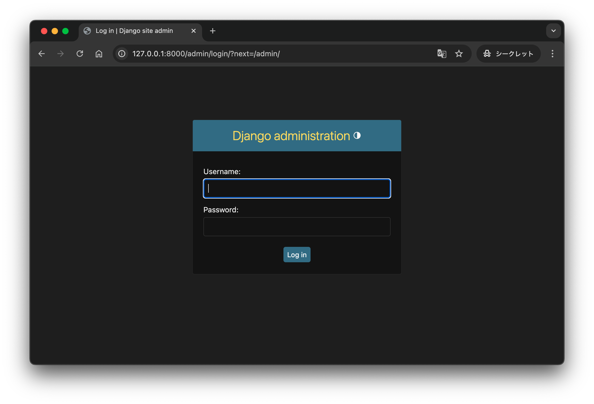
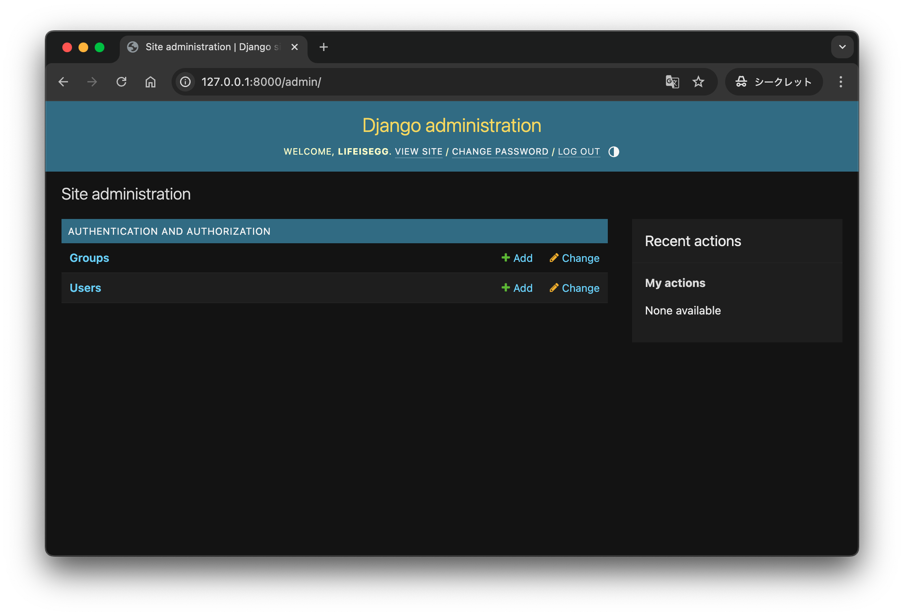

# Django-Vue-GraphQL

## Building the environment

Backend: Django
Frontend: Vue
GraphQL

## Step1： Djangoブログを設定する

- Workspace 作成

  ```sh
  ❯ mkdir Django-Vue-GraphQL
  ❯ cd Django-Vue-GraphQL
  ❯ pwd
  ./Django-Vue-GraphQL
  ```

- バックエンド環境設定

  ```sh
  ❯ mkdir back_end/
  ❯ cd back_end
  ❯ pwd
  ./Django-Vue-GraphQL/back_end
  ```

- Django 設置

  ```sh
  ❯ pwd
  ./Django-Vue-GraphQL/back_end
  ❯ python -m venv venv
  ❯ source venv/bin/activate

  ❯ touch requirements.txt
  ❯ echo "Django==5.0.2" > requirements.txt
  ❯ python -m pip install -r requirements.txt
  ```

- Django プロジェクト生成

  ```sh
  ❯ pwd
  ./Django-Vue-GraphQL/back_end
  ❯ django-admin startproject backend .
  ```

  <details><summary>生成後構成</summary>

    ```sh
    Django-Vue-GraphQL/
    ├── venv
    └── back_end/
        ├── manage.py
        ├── requirements.txt
        └── backend/
            ├── __init__.py
            ├── asgi.py
            ├── settings.py
            ├── urls.py
            └── wsgi.py
    ```

  </details>

- Django マイグレーション

  ```sh
  ❯ pwd
  ./Django-Vue-GraphQL/back_end
  ❯ python manage.py migrate
  ```

- Django Superuser 生成

  ```sh
  ❯ pwd
  ./Django-Vue-GraphQL/back_end
  ❯ python manage.py createsuperuser
  Username (leave blank to use 'lifeisegg'): lifeisegg
  Email address: lifeisegg@gmail.com
  Password:
  Password (again):
  This password is too common.
  Bypass password validation and create user anyway? [y/N]: N
  Password:
  Password (again):
  Superuser created successfully.
  ```

- 作業確認

  ```sh
  ❯ pwd
  ./Django-Vue-GraphQL/back_end
  ❯ python manage.py runserver
  Watching for file changes with StatReloader
  Performing system checks...

  System check identified no issues (0 silenced).
  September 20, 2024 - 02:01:43
  Django version 5.0.2, using settings 'backend.settings'
  Starting development server at http://127.0.0.1:8000/
  Quit the server with CONTROL-C.
  ```

  
  
  

## Step2： Djangoブログマネージャを作成する

- Django ブログアプリケーションの作成

  ```sh
  ❯ pwd
  ./Django-Vue-GraphQL/back_end
  ❯ python manage.py startapp blog
  ```

  <details><summary>生成後構成</summary>

    ```sh
    Django-Vue-GraphQL/
    ├── venv
    └── back_end/
        ├── manage.py
        ├── requirements.txt
        └── backend/
        │   └── ...
        └── blog
          ├── __init__.py
          ├── admin.py
          ├── apps.py
          ├── migrations
          │   └── __init__.py
          ├── models.py
          ├── tests.py
          └── views.py
    ```

  </details>

- Django ブログアプリケーションの有効化
  - プロジェクトで新しいblogアプリケーションを知ることができるようにするには、インストールされているアプリケーションのリストに追加する必要があります。
  - INSTALLED_APPSで変数を更新します。
  - back_end/backend/settings.py

    ```diff
    INSTALLED_APPS = [
        "django.contrib.admin",
        "django.contrib.auth",
        "django.contrib.contenttypes",
        "django.contrib.sessions",
        "django.contrib.messages",
        "django.contrib.staticfiles",
    +   "blog.apps.BlogConfig",
    ]
    ```

- Djangoブログデータモデルの作成
  1. Profileブログユーザーに関する追加情報を保存します。
  2. Tagブログ投稿をグループ化できるカテゴリを表します。
  3. Post各ブログ投稿のコンテンツとメタデータを保存します。

## Step3： Graphene-Djangoの設定

## Step4： django-cors-headersを設定する

## Step5： Vue.jsを設定する

## Step6： 基本ビューとコンポーネントを作成する

## Step7： Vueコンポーネントを更新する

## Step8： Vue Apolloの実装

## Step9： データをインポートする
